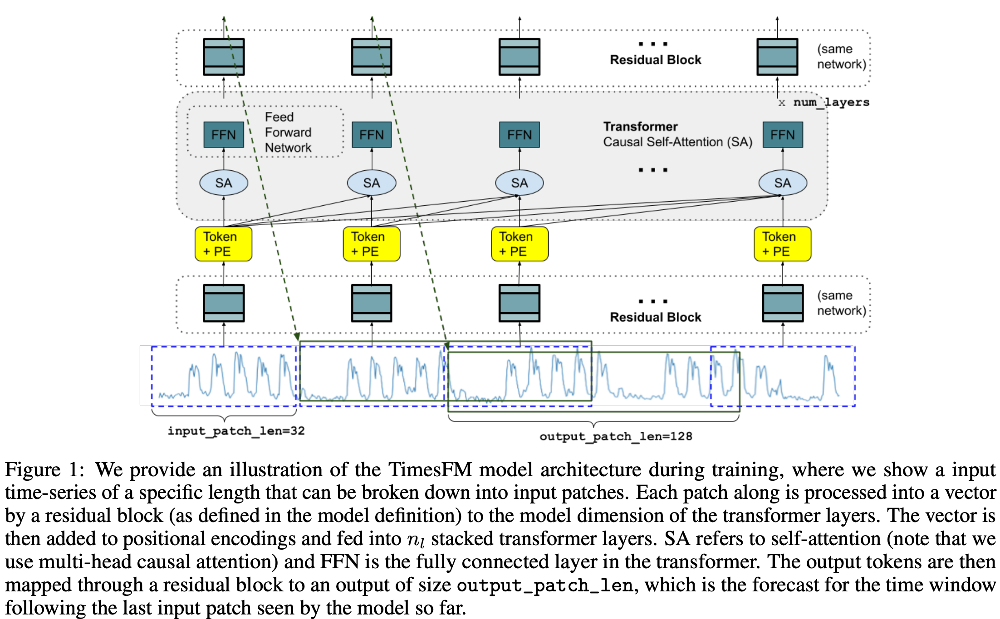
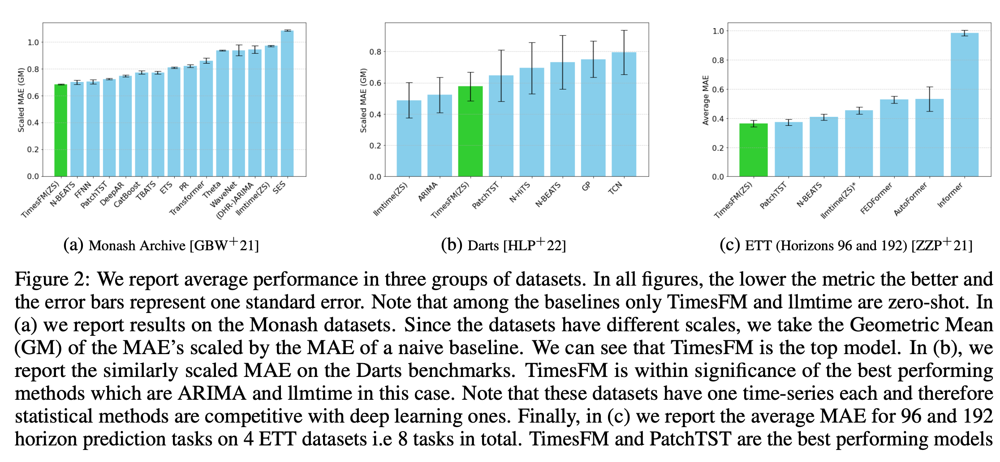

## What is Foundation Model

- A foundation model is a general-purpose model trained on large-scale data that can be adapted to various downstream tasks.

- GPT-3 and BERT in natural language processing are typical examples, with the ability to perform new tasks with **zero-shot** through extensive corpus learning

- There is a study on a model in which this concept is also introduced to time series data prediction (time series forcasting) and performs prediction tasks of multiple time series domains universally with one prior learning.

## How it works

{width=\textwidth}

## 

{width=\textwidth}

## 

- It's a method used in the latest LLM, but I don't have a paper written in the energy time series, but I think it's worth studying.

- Since it is publicly available for use as TimesNet, we propose a Foundation Model.

## Reference

- Bommasani, R., et al. (2021). On the Opportunities and Risks of Foundation Models. arXiv preprint arXiv:2108.07258.

- Das, A., et al. (2024). A Decoder-only Foundation Model for Time-series Forecasting. arXiv preprint arXiv:2310.10688.

- Liang, Y., et al. (2024). Foundation Models for Time Series Analysis: A Tutorial and Survey. arXiv preprint arXiv:2403.14735.

